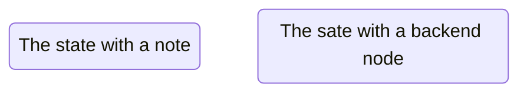
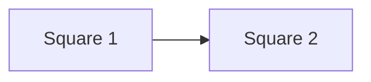

## Linked List
- Linked lists are an ordered collection of objects. So what makes them different from normal lists? Linked lists differ from lists in the way that they store elements in memory. While lists use a contiguous memory block to store references to their data, linked lists store references as part of their own elements.

### Main Concepts
Before going more in depth on what linked lists are and how you can use them, you should first learn how they are structured. Each element of a linked list is called a ```node```, and every node has two different fields:
  1. ```Data``` contains the value to be stored in the node.
  2. ```Next``` contains a reference to the next node on the list.

Here’s what a typical node looks like:


```mermaid
rectangle R {
  fill: #ccc
  stroke: #333
  width: 200px
  height: 100px
}

line L {
  start: R.center
  end: R.center
  stroke: #333
  linetype: dashed
}
```
> [!NOTE]
> A ```linked list``` is a collection of nodes. The first node is called the ```head```, and it’s used as the starting point for any iteration through the list. The last node must have its ```next``` reference pointing to ```None``` to determine the end of the list.
Here’s how it looks:


- Reference(s):
  - https://realpython.com/linked-lists-python/
